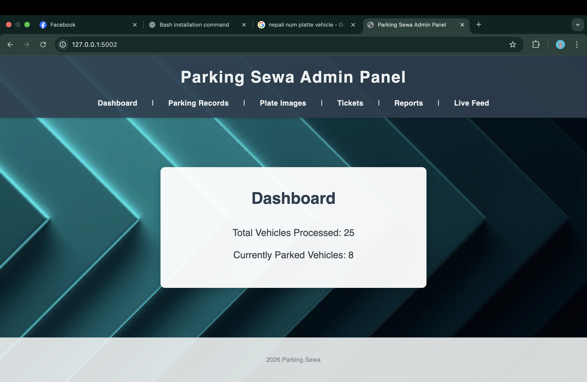
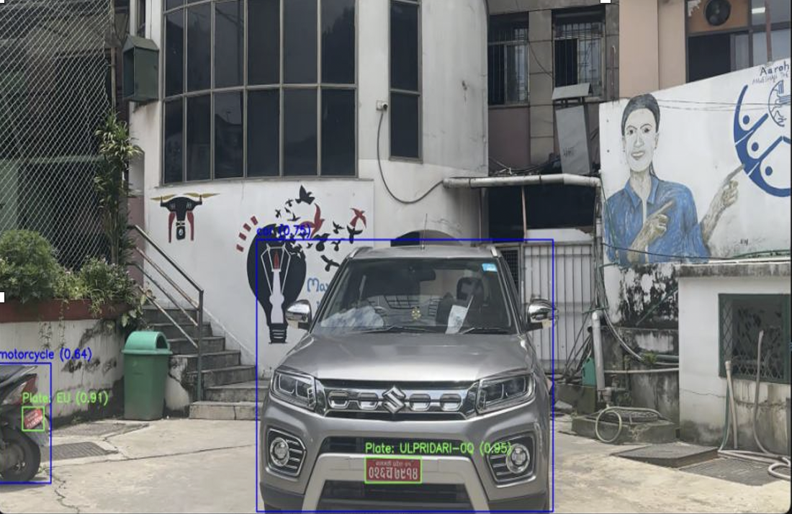
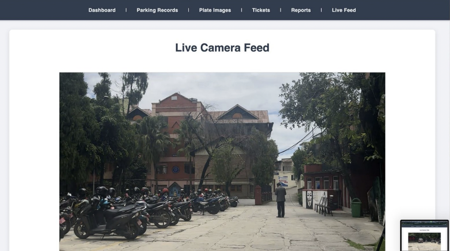
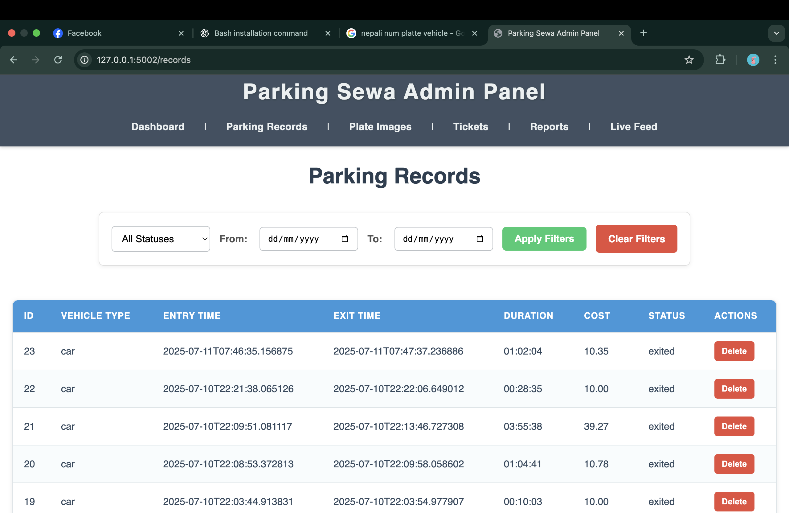
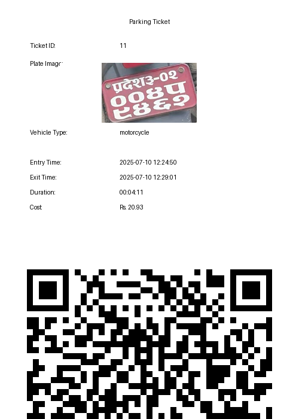
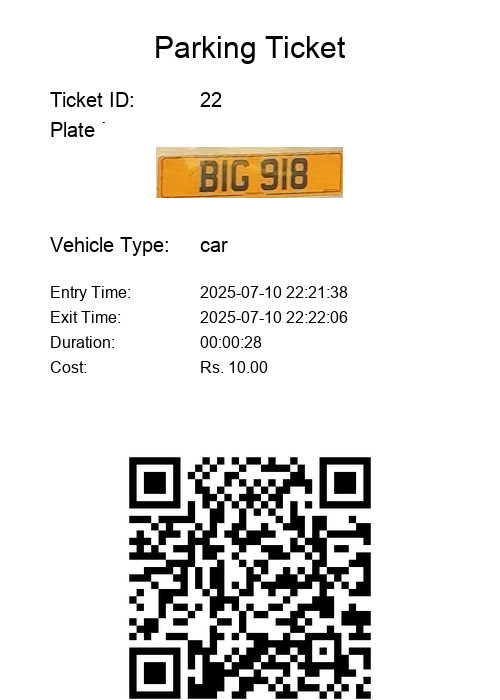

#  Parking-Sewa  
**Smart Parking Management System**

Parking-Sewa is a smart parking management system designed to automate vehicle entry, exit, verification, and billing using computer vision techniques. The system focuses on **visual plate matching instead of text reading**, making it reliable for real-world conditions in Nepal.

---

## Features

- **Automatic License Plate Detection** using YOLOv8  
- **Visual Plate Verification** using perceptual image hashing  
- **Automatic Entry & Exit Time Tracking**  
- **Automated Parking Fee Calculation**  
- **Vehicle Type Classification** (Car, Bike, Truck, etc.)  
- **Auto Ticket Generation with QR Code**  
- **Voice Feedback System**  
- **Admin Dashboard with Live Camera Feed**  
- **SQLite Database for Parking Records**

---

## Project Objectives

- Reduce manual effort in parking management  
- Improve accuracy in vehicle verification  
- Enable automated billing based on duration and vehicle type  
- Provide a reliable system suitable for Nepali parking environments  
- Enhance parking security and record keeping  

---

##  System Overview

The system works by:
1. Capturing vehicle images at entry and exit points  
2. Detecting the number plate using YOLOv8  
3. Cropping the plate and generating a **visual hash**  
4. Matching entry and exit plate images using similarity comparison  
5. Calculating parking duration and generating bills automatically  

This approach is **language-independent** and robust against lighting, angle, and plate quality variations.

---

## 🛠️ Technologies Used

### Backend
- **Python**
- **Django**

### Computer Vision & AI
- **YOLOv8** (License plate detection & vehicle classification)
- **OpenCV**
- **ImageHash**
- **MobileNetV2 (CNN Features)**

### Database
- **SQLite3**

### Frontend
- **HTML**
- **CSS**
- **JavaScript**

### Other Libraries
- Pillow  
- NumPy  
- pyttsx3  

---

##  Dataset

- **Custom License Plate Dataset** (8,000+ images from Kaggle)  
- Trained YOLOv8 model for accurate plate detection  
- Pretrained YOLOv8 model used for vehicle type classification  

---
## Project Screenshots

### Admin Dashboard

  

### Live testing

  

### Live Camera Detection

  

### Vehicle Records

  

### Parking Tickets

  
  

  

